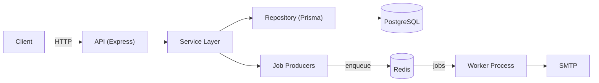

# 🔐 Auth Service

> A production-grade Authentication & Authorization service built with **TypeScript**, **Express**, **PostgreSQL**, **Prisma**, **Redis**, and **BullMQ** — with JWT auth, refresh-token rotation, multi-device sessions, and a background email pipeline.

Inspired by platforms like Auth0, Clerk, and Supabase Auth, and built with a clean, layered architecture (routes → controllers → services → repositories).

---

## ✨ Features

**Authentication**
- User registration & login
- JWT access tokens + refresh tokens
- Refresh-token **rotation** (single-use) with hashing
- Protected routes & current-user endpoint

**Session Management**
- Multi-device sessions (device + IP tracked)
- Logout current session / logout all
- List active sessions & revoke individual sessions

**Account & Password**
- Email verification + resend
- Forgot / reset password
- Change password (revokes other sessions)

**Infrastructure & Security**
- Argon2 password hashing
- Zod request validation
- Helmet + CORS
- Redis-backed rate limiting
- Background email delivery via BullMQ (API responds without waiting on SMTP)
- Centralized + async error handling
- Environment validation with Zod
- Dockerized (multi-stage build, separate worker) & CI via GitHub Actions

---

## 🧱 Tech Stack

| Category | Technology |
|----------|------------|
| Runtime | Node.js 20 |
| Language | TypeScript |
| Framework | Express |
| ORM | Prisma |
| Database | PostgreSQL |
| Cache / Queue | Redis + BullMQ |
| Auth | JWT |
| Hashing | Argon2 |
| Validation | Zod |
| Mail | Nodemailer |
| Logging | Pino |
| Docs | Swagger / OpenAPI 3 |
| Container | Docker + Docker Compose |
| CI | GitHub Actions |

---

## 📂 Folder Structure

```text
src/
├── app.ts                  # Express app (middleware, routes, Swagger)
├── server.ts               # API entry point
├── worker.ts               # Background worker entry point
├── config/
│   ├── env.ts              # Zod-validated environment
│   └── swagger.ts          # OpenAPI 3 spec
├── core/
│   ├── errors/             # AppError
│   ├── middleware/         # error, notFound, logger, rate limiter
│   ├── logger/             # Pino
│   └── utils/              # asyncHandler
├── database/               # Prisma client
├── redis/                  # Redis client
├── jobs/                   # BullMQ
│   ├── connection.ts       # shared queue connection
│   ├── queues/             # queue definitions
│   ├── producers/          # enqueue functions (auth calls these)
│   └── workers/            # job processors
├── modules/
│   ├── auth/               # controller, service, repository, routes, jwt, ...
│   └── mail/               # mailer + templates
└── routes/                 # route aggregator
```

---

## 🏗 Architecture

Layered / clean architecture with a repository pattern, plus a separate worker process for background jobs:



📊 **Full diagrams** (auth flow, refresh rotation, session management, deployment): see [`docs/ARCHITECTURE.md`](docs/ARCHITECTURE.md).

---

## 📌 API Endpoints

Base path: `/api/v1`

### Authentication
| Method | Endpoint | Auth |
|--------|----------|------|
| POST | `/auth/register` | — |
| POST | `/auth/login` | — (rate limited) |
| POST | `/auth/refresh` | — |
| GET | `/auth/me` | Bearer |
| POST | `/auth/logout` | Bearer |
| POST | `/auth/logout-all` | Bearer |

### Sessions
| Method | Endpoint | Auth |
|--------|----------|------|
| GET | `/auth/sessions` | Bearer |
| DELETE | `/auth/sessions/:id` | Bearer |

### Email
| Method | Endpoint | Auth |
|--------|----------|------|
| POST | `/auth/verify-email` | — |
| POST | `/auth/resend-verification` | — |

### Password
| Method | Endpoint | Auth |
|--------|----------|------|
| POST | `/auth/forgot-password` | — |
| POST | `/auth/reset-password` | — |
| POST | `/auth/change-password` | Bearer |

### System
| Method | Endpoint | Auth |
|--------|----------|------|
| GET | `/health` | — |

---

## 🚀 Setup Guide (local)

```bash
# 1. Clone
git clone https://github.com/Naval1525/authService.git
cd authService

# 2. Install
npm install

# 3. Environment
cp .env.example .env      # then set JWT_SECRET (and SMTP_* if you want real emails)

# 4. Database (needs Postgres + Redis running locally)
npx prisma migrate dev
npx prisma generate

# 5. Run (two terminals)
npm run dev               # API on http://localhost:8080
npm run worker            # background email worker
```

### Environment variables
| Variable | Description |
|----------|-------------|
| `PORT` | API port (default `8080`) |
| `NODE_ENV` | `development` \| `production` |
| `APP_URL` | Public base URL (used in email links) |
| `DATABASE_URL` | PostgreSQL connection string |
| `REDIS_URL` | Redis connection string |
| `JWT_SECRET` | Secret for signing tokens |
| `SMTP_HOST/PORT/USER/PASS` | SMTP config (optional — emails are logged if unset) |
| `MAIL_FROM` | Default "from" address |

---

## 🐳 Docker Guide

The stack (Postgres + Redis + one-shot migrations + API + worker) runs with one command:

```bash
cp .env.example .env      # set a real JWT_SECRET
docker compose up --build
```

- API: http://localhost:8080
- `migrate` runs `prisma migrate deploy` once, then `api` and `worker` start after Postgres/Redis are healthy.
- `api` and `worker` share the **same multi-stage image** with different start commands.

```bash
docker compose down          # stop
docker compose down -v       # stop + wipe volumes
```

---

## 📖 Swagger Guide

Interactive API docs are served by the running API:

- **Swagger UI:** http://localhost:8080/docs
- **Raw OpenAPI JSON:** http://localhost:8080/docs.json

Use the **Authorize** button (Bearer token) in Swagger UI to call protected endpoints with an access token from `/auth/login`.

---

## 🔮 Future Improvements

- OAuth (Google / GitHub) & SSO
- MFA / TOTP and WebAuthn passkeys
- Role-based access control (RBAC) & organizations
- API keys
- Account lockout & audit logs
- Integration & load tests

---

## 📄 License

MIT — see [LICENSE](LICENSE).

## 👨‍💻 Author

**Naval Bihani** — Backend Engineer
[GitHub](https://github.com/Naval1525) · [LinkedIn](https://www.linkedin.com/in/naval-bihani/)
