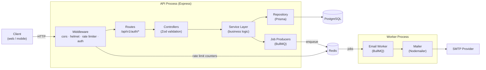
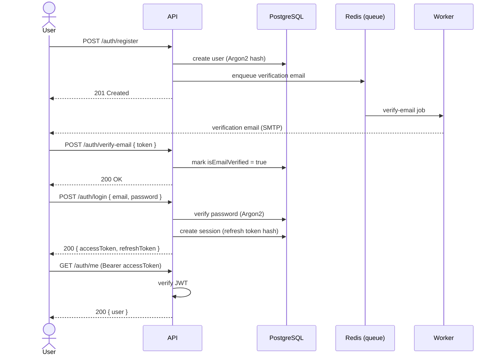
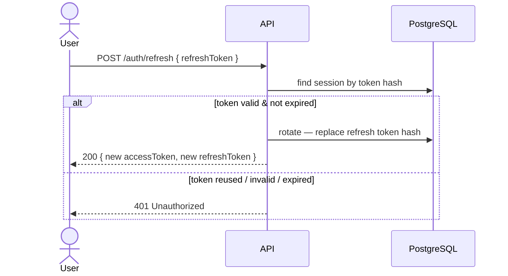
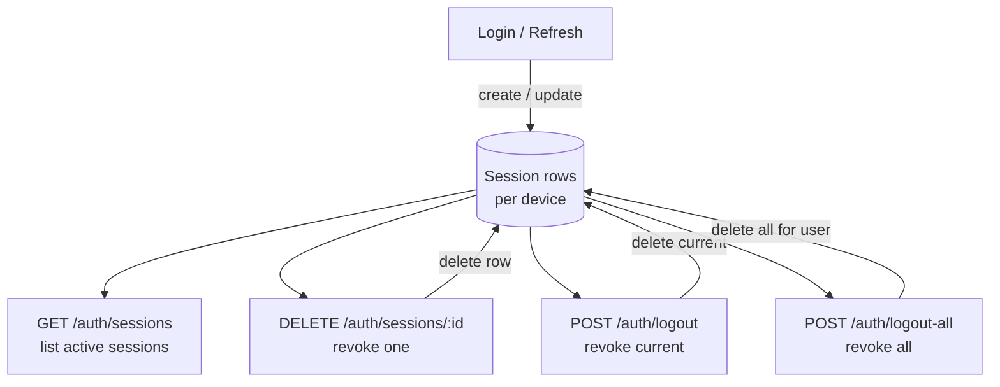
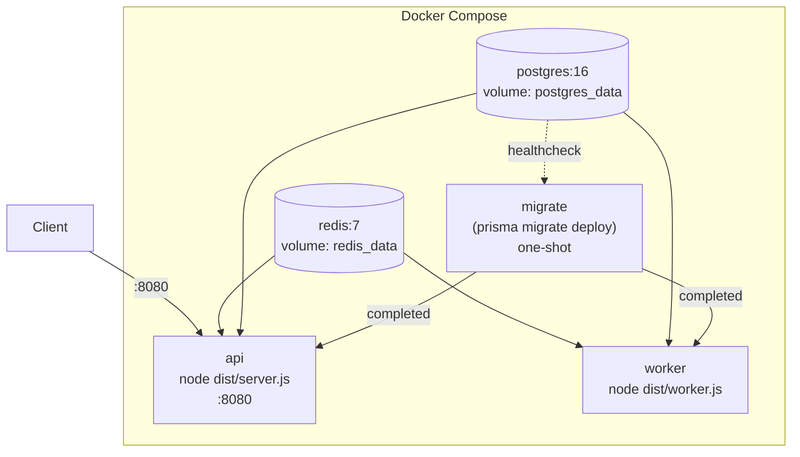

# Architecture

Diagrams for the Authentication Service. All diagrams use [Mermaid](https://mermaid.js.org/) and render natively on GitHub.

---

## 1. High-Level Architecture

---

## 2. Authentication Flow (Register → Verify → Login)

---

## 3. Refresh Token Rotation

Each refresh **rotates** the stored token hash, so a previously issued refresh
token can be used only once. A reused (already-rotated) token is rejected.

---

## 4. Session Management

Every login creates a session row (device, IP, timestamps). Sensitive actions
such as password reset/change revoke other sessions.

---

## 5. Deployment Architecture (Docker Compose)

`migrate` runs once and exits after applying migrations; `api` and `worker`
start only after it succeeds and after Postgres/Redis report healthy. `api` and
`worker` are the **same image** with different start commands.
